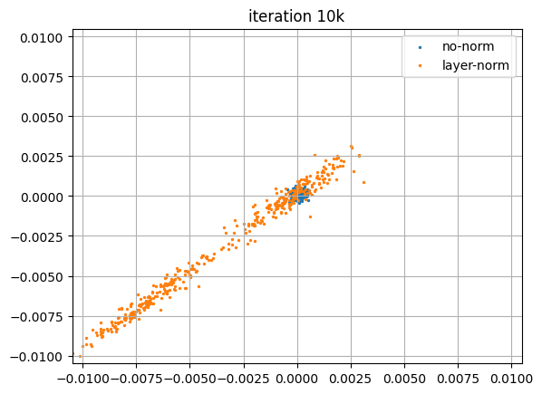

# Is LayerNorm in DiT a problem?

In DiT architecture, there is a LayerNorm before every layer.

Normalization is an useful tool for deep neural networks, and create features that are invariant to scale and shift, which is usually a good thing.
However, we posit that in the context of the denoising task, the scale and shift information of the input is useful and should be preserved.
LayerNorm runs counter to that intuition and would destroy it instead.

This repository aim to explore this hypothesis. It is a fork from the [official DiT Pytorch repo](https://github.com/facebookresearch/DiT/tree/main).

# Visualizing Embeddings

In a similar scenario, the excellent [StyleGAN-2 paper](https://arxiv.org/abs/1912.04958) shows that when a generator needs the scale and shift information in its features but is forced to normalize them in the architecture, it can still smuggle the information by inserting very high values in the embeddings.
In the context of StyleGAN, the normalization is made across the image feature map, and having these high value outlyers causes visual artifacts when those feature maps are decoded.

In DiT, an image is split into a set of tokens, and the embedding vectors for each token are normalized independently.
Using the script in `TokenEmbeddingsViz.ipynb`, we visualize random embedding vectors accross every layer of a pretrained DiT.
We want to check if, as in StyleGAN feature maps, they also contains some large values that would indicate that the network is indeed trying to bypass the normalization.

Each plot correspond to the embedding of one token in one layer of the DiT. On the x axis are indexes in the embedding vector, and on the y axis are their absolute values. In other words, the value of the index x of the embedding vector is y.
Notice that except for the first and last layers, all embeddings have most of their values near 0 but at least one very large value, very much like in the StyleGAN feature maps.
I believe this is a good indication that LayerNorm might not be the best tool for the job, as the network has to work harder to counteract the normalization of the embedding.
However, as evidenced by the last layer retaining normal values, the outlyer values are easily filtered out, so it might not impact the performance of the model in practice.

# Inverting the LayerNorm?

At the heart of the problem with normalization is that it destroy information, i.e. the layer is not invertible.
However, we see in the previous visualization that a neural network can bypass that. In this section, we try to analyze the ability of a DiT to do so in a simple, controlled, experiment.
One easy way to do so is by checking how well a DiT can learn the identity function. 
Because the model is trained to denoise, it's actually very easy to implement by training the model to generate a constant data (x = 0). 
If the clean data is always 0, the input of the network is always exactly the noise it has to predict (scaled by a factor that is a function of t, the diffusion timestep).

So we build a very small DiT that we train to generate always null "images" of size 2x2x2. We remove the VAE and have the DiT operates directly on "pixels".
We train one version with LayerNorm, and one where we removed the LayerNorm, with batch sizes 2048.

We visualize the values of the outputs after 10k iterations and after 50k iterations. To do so, we simply plot the values of each pixels in 2D (as they have 2 channels) for 100 samples (so in total 400 = 100 x 2 x 2 pixels).

We see that both models are able to generate pixels close enough to x = 0, but we see that without LayerNormalization, the model easily gets errors below 10e-3, in the order of 10e-4, that the model with layer normalization is not able to attain so far.

# tl;dr: Is that a problem?
Probably not. DiT are PixArt models work very well in practice, and the neural network can come up with effective solutions.

It might run into conflicts with very some tricks such as very aggressive weight-decay and drop-out, that could hinder the ability of the model to build and effectively use the large values they insert. Also, it doesn't seem productive to, why add a layer that the network has to actively work against.
